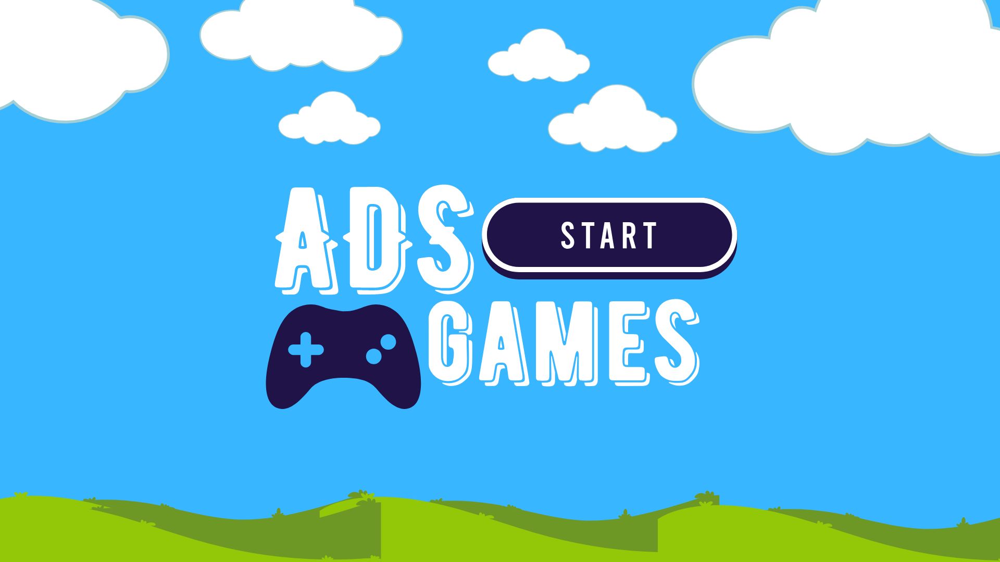

<h1 align="center">
  ADS Games
</h1>

  
  
  
  
  

  
  
  

  

## 📝 Sobre

O projeto **ADS Games** é um repositório de jogos desenvolvidos por alunos do curso de Análise e Desenvolvimento de Sistemas da UNIFIP. O objetivo é compartilhar conhecimento e experiências com a comunidade de desenvolvedores.

### 📚 Jogos

- [x] **Jogo Ball**
- [x] **Jogo com Script**

### 🚀 Tecnologias

- [Godot Engine](https://godotengine.org/)
- [GDScript](https://docs.godotengine.org/pt_BR/stable/getting_started/scripting/gdscript/gdscript_basics.html)

### 🧠 Aprendizado

- [x] **Godot Engine**
- [x] **GDScript**
- [x] **Desenvolvimento de jogos**
